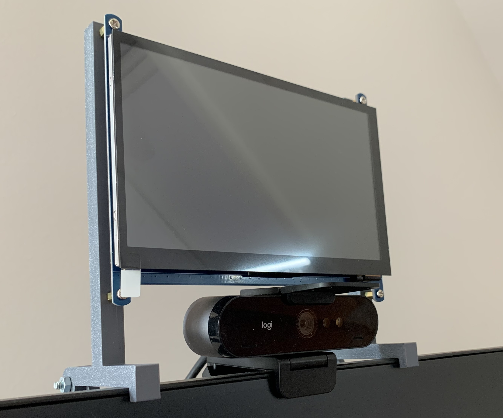
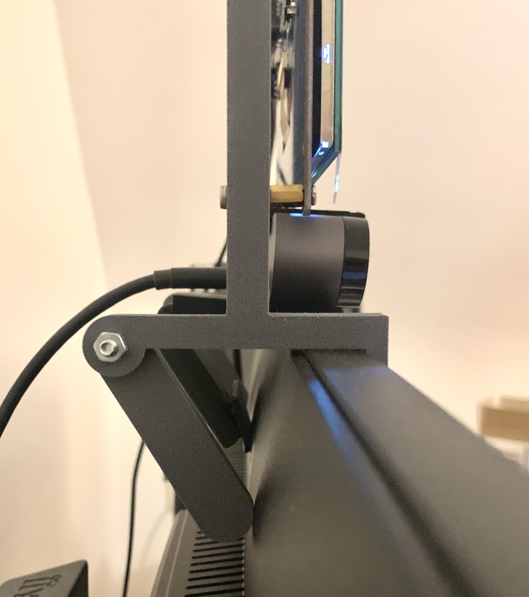

Screentop Monitor
=================

This little project is a frame for a small monitor that can be placed your main monitor's upper edge, leaving a gap for you webcam.

The monitor is useful for video calls or just your todo list - or any other small windows you'd like to have on a small, separate screen.

The frame consists of two poles and to legs, one set for each side. The pole has a little bracket on it's foo that stops the monitor for falling backwards, where the leg supports the pole from behind. When fixed to the display, the setup is quite stable.

## Building

To build, you need:
* A Waveshare LCD Display 7 inch display like the [7inch HDMI LCD (C)](https://www.waveshare.com/product/displays/lcd-oled/lcd-oled-1/7inch-hdmi-lcd-c.htm?___SID=U), or one that fits the measurements
* 3D prints from [waveshare-display-frame-pole.stl](waveshare-display-frame-pole.stl) and [waveshare-display-frame-leg.stl](waveshare-display-frame-leg.stl) - print them twice, you need one set for each side
* 4x M3x12mm screws to fix the frame to the display
* 2x M4x15mm screws and matching nuts to fix each leg to its pole

The waveshare display already has 4x M3 screws and matching spacer nuts. Insert the screws threw the holes on the corners and fix them with the spacer nuts from the back. Then, put the M3x12mm screws into the holes at the back of the poles and screw those into the spacer nuts on the display from behind. After that, use the M4 screws and nuts to fix the legs to the pole bases. Adjust the angle of the leg so that it supports the frame against the monitor nicely.

## Modifications

The frame is designed in the awesome [FreeCad](https://www.freecad.org/). The schematic is entirely parametric, so you can modify the frame easily by simply changing a measure to make it fit to your screen. Please mention where your design is based upon if you re-publish (see the [LICENSE](LICENSE))
